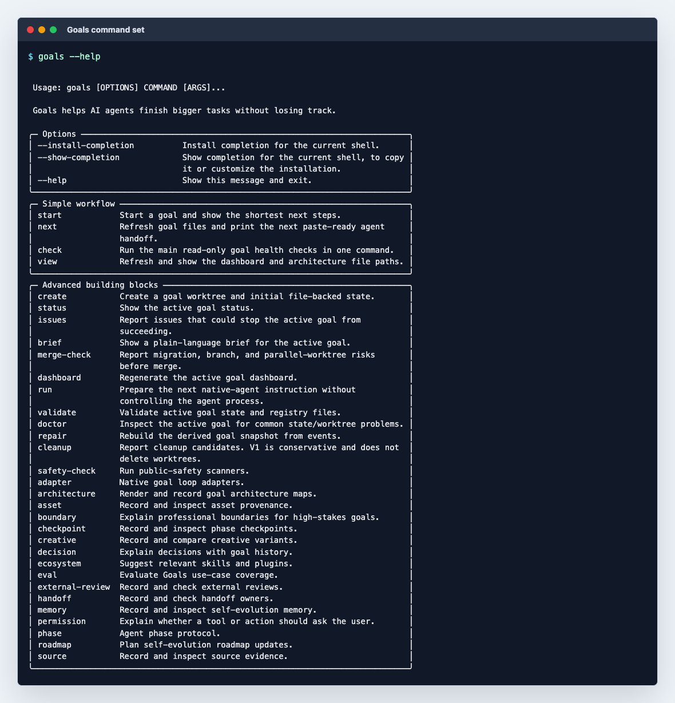
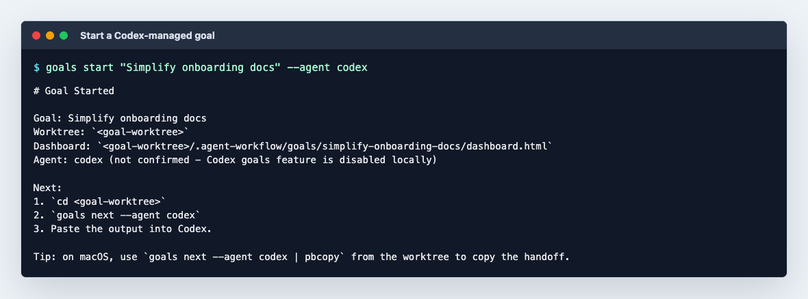
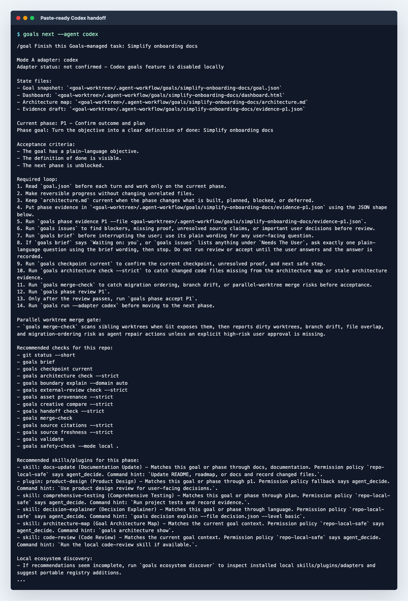
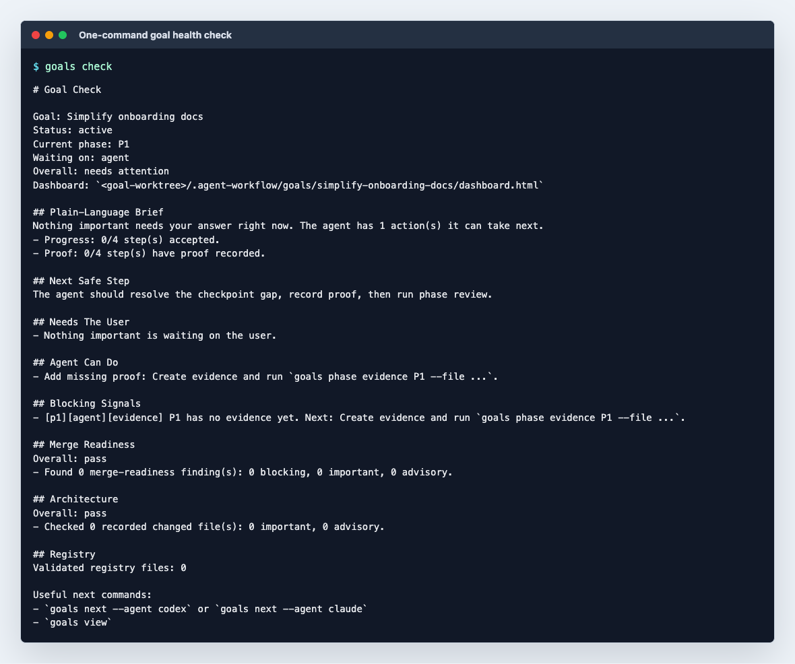
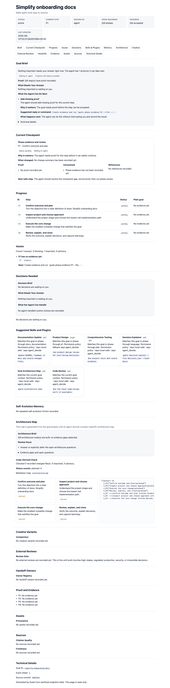

# Goals

Goals helps Codex, Claude Code, and other local agents finish bigger repo tasks
without losing the thread.

It does not replace the native agent. It gives the agent a durable workflow
layer: a goal worktree, phase state, evidence, checks, decisions, handoffs, and
a dashboard a human can read.

## The Simple Command Set

Most users should only need these four commands:

| Command | What it combines |
| --- | --- |
| `goals start` | Creates the goal worktree, goal state, dashboard, and first agent handoff instructions. |
| `goals next` | Refreshes generated files and prints the paste-ready `/goal` handoff for Codex or Claude. |
| `goals check` | Combines the brief, checkpoint, issues, merge readiness, architecture check, and registry validation into one status view. |
| `goals view` | Refreshes the dashboard and architecture map, then prints their file paths. |

The lower-level commands still exist as advanced building blocks, but the daily
loop should feel like: start, paste, check, view.

## Prerequisites

- [`uv`](https://docs.astral.sh/uv/getting-started/installation/) — used for every
  install and command below. `uv` also auto-provisions Python 3.11+, so you do not need
  to install Python separately.
- `git` — `goals start` operates on a clean git repository with at least one commit.

## Install

From this repository:

```bash
uv tool install --editable .
```

That puts `goals` on your PATH so the generated handoff can tell Codex or Claude
to run plain `goals ...` commands inside your project.

For development inside this repository, use:

```bash
uv sync
uv run pytest -q
```

## Use With Codex

Run this inside a clean git repo with at least one commit:

```bash
goals start "Ship the onboarding cleanup" --agent codex
cd <worktree printed by goals>
goals next --agent codex | pbcopy
```

Paste the copied output into Codex. If the Codex native `/goal` feature is not
enabled locally, the generated prompt still works: paste it into the current
Codex thread and let Goals remain the state layer.

`pbcopy` is macOS-only. On Linux use `| xclip -selection clipboard` or `| wl-copy`;
on Windows use `| clip`. Or just run `goals next --agent codex` and copy manually.

During the run:

```bash
goals check
goals view
goals next --agent codex | pbcopy
```

## Use With Claude Code

The Claude flow is the same, with a different handoff adapter:

```bash
goals start "Ship the onboarding cleanup" --agent claude
cd <worktree printed by goals>
goals next --agent claude | pbcopy
```

Paste the copied output into Claude Code. If Claude is not installed or not on
PATH, Goals still generates a Claude-shaped handoff that you can copy manually.

`pbcopy` is macOS-only. On Linux use `| xclip -selection clipboard` or `| wl-copy`;
on Windows use `| clip`. Or just run `goals next --agent claude` and copy manually.

During the run:

```bash
goals check
goals view
goals next --agent claude | pbcopy
```

## Screenshots

These screenshots were generated from a fresh temporary git repo after an
editable `uv tool install`, using the same commands shown above.

### Four-command help surface



### Start a Codex goal



### Paste-ready Codex handoff



### Paste-ready Claude handoff


### Combined goal check



### Dashboard



## How It Works

`goals start` creates a git worktree and writes generated state under:

```text
.agent-workflow/goals/<goal-id>/
```

That state is ignored by git by default because it can contain local paths and
private run history. The generated dashboard lives in the same directory.

The native agent owns the work. Goals owns the structure around the work:

- phases and acceptance criteria
- proof and evidence
- user-facing decisions
- source, asset, and review records
- merge-readiness checks
- a dashboard for humans

## Extending Goals

Goals is intentionally built as a small workflow layer over composable
primitives.

- Add or change high-level user workflows in `src/goals/workflows.py`.
- Keep `src/goals/cli.py` thin: CLI commands should mostly call workflow helpers
  or existing domain modules.
- Add reusable capabilities as focused modules under `src/goals/`.
- Add portable tool, skill, plugin, permission, and adapter metadata under
  `registries/*.yml`.
- Keep advanced commands available for agents and scripts, but prefer a small
  memorable top-level command set for humans.

The current advanced building blocks include:

```bash
goals phase evidence
goals phase review
goals phase accept
goals brief
goals issues
goals merge-check
goals checkpoint current
goals source citations
goals asset provenance
goals creative compare
goals external-review check
goals handoff check
goals ecosystem recommend
goals permission check
goals safety-check --mode local .
```

## Status

This repository is an early MVP.

Mode A is implemented:

- Codex or Claude owns the native goal loop.
- Goals owns project-local state, evidence, checks, and dashboard output.
- The CLI does not launch or control Codex or Claude processes.

Mode B, a standalone runner for local AI or schedulers, is represented by
runtime interfaces but is not complete yet.

See [ROADMAP.md](ROADMAP.md) for planned directions.
