# Goals

**A no-nonsense workflow engine for long-running agent loops.** Goals keeps the
plan, decisions, and proof in files you own so you can trust, verify, fix, and
resume the work.


**Just say what you want — for example:**

- *"build me a weight-loss tracking app"*
- *"make a web app that resizes and tags my photos"*
- *"add login and payments to my site"*
- *"clean up and document this messy codebase"*

## What Goals does

- **Trust the loop.** State, decisions, evidence, and history stay readable while
  the work keeps moving.
- **Verify before done.** Checks actually run before a step is accepted, so "done"
  is earned instead of asserted.
- **Fix what breaks.** Failed verification points to the next repair instead of
  vague retrying.
- **Resume without losing the thread.** Portable files survive `/clear`, new
  sessions, and agent switches.

## Who it's for

Anyone using AI to get real work done:

- **If you don't code** — you describe the goal and approve decisions in plain English;
  your AI assistant does the heavy lifting, and Goals keeps it on track.
- **If you do code** — a durable, scriptable workflow layer that keeps long AI tasks on
  the rails, with evidence, gates, and a readable audit trail.

## How it works

```
   you say the goal
         │
         ▼
   Goals breaks it into clear steps  ──▶   your AI does the next step
         ▲                                        │
         │            you say yes   ◀──── plain decision + proof it works
         └─────────  repeat until done — with a record of everything  ◀─┘
```

Goals runs the **workflow**; your AI assistant (Claude Code, Codex, …) does the **work**.
Goals is the part that keeps it organized, legible, and accountable.

Under the hood it's a small CLI + plugin over plain files you own. The goal
lifecycle — `start` → assess → a phase loop where each step's checks must *run*
before it's accepted → `finish`:



See [**docs/marketing-refresh/02-architecture-diagrams.md**](docs/marketing-refresh/02-architecture-diagrams.md)
for the full set: system architecture, the goal lifecycle, skill-first discovery +
capability gaps, and the portability layer that lets a goal survive `/clear`.

## Get started

**1. Install Goals** — one line. It installs everything it needs (including `uv` and
Python); nothing required up front.

**macOS / Linux**

```bash
curl -fsSL https://raw.githubusercontent.com/ShivamGupta42/goals/main/install.sh | sh
```

**Windows (PowerShell)**

```powershell
irm https://raw.githubusercontent.com/ShivamGupta42/goals/main/install.ps1 | iex
```

**2. Connect your AI assistant** — one command, for Claude Code *and* Codex:

```bash
goals setup --agent both        # or: --agent claude  |  --agent codex
```

That's it. Now just talk to it in Claude Code:

| You type | What happens |
| --- | --- |
| `/goals:create "build me a weight-loss tracking app"` | Goals turns it into a tracked plan and starts step 1 |
| `/goals:next` | Do the next step; Goals saves the proof and checks it off |
| `/goals:check` | See where things stand and what (if anything) needs *you* |

Prefer the terminal? Use `goals start "…"`, then `goals next` and `goals check` — see
[The command set](#the-command-set).

<details><summary>Rather not pipe a script? Install manually</summary>

```bash
# needs uv (https://astral.sh/uv): curl -LsSf https://astral.sh/uv/install.sh | sh
uv tool install git+https://github.com/ShivamGupta42/goals.git
goals setup --agent both
```
</details>

## Why Goals exists

AI agents wander. They skip steps, make quiet decisions, and after a while you've lost
track of what they did. When they *do* turn to you to decide, it's hard — the choice
comes wrapped in jargon you shouldn't have to decode. And once it's built, they often
can't clearly tell you what they made or how.

Goals fixes that. Tell it what you want in plain English. It breaks that into a clear
plan, keeps your AI on track step by step, puts every decision to you in plain words
you can actually answer, and won't say "done" until there's proof. Works whether you
write code or not.

## The command set

Most people only need these:

| Command | What it does |
| --- | --- |
| `goals start "add login and payments to my site"` | Turn a goal into a tracked plan and open a workspace for it |
| `goals next` | Get the next step, ready to hand to your AI |
| `goals check` | Plain-language status: progress, proof, and what needs you |
| `goals view` | Open the dashboard — your goal at a glance, for humans |
| `goals loop` | Design, check, and improve the workflow itself |

## For developers

Under the hood, Goals is a small CLI + Claude Code / Codex plugin. It keeps goal state,
evidence, decisions, and an append-only history as plain files in your repo, plus a
portable spec any agent can pick up. On `main` it works in an isolated git worktree so
your checkout stays clean. `goals check --json` gives agents a machine-readable view.

Note: `goals start` runs in a git project (it makes a safe, isolated copy to work in).
Run `goals --help` for the full CLI, portability commands, and the visual loop builder.

## Show you use Goals

Running a project with Goals? Add the badge to your README:

[](https://github.com/ShivamGupta42/goals)

```md
[](https://github.com/ShivamGupta42/goals)
```

## Contributing

Issues and PRs welcome.

## License

[MIT](LICENSE)
