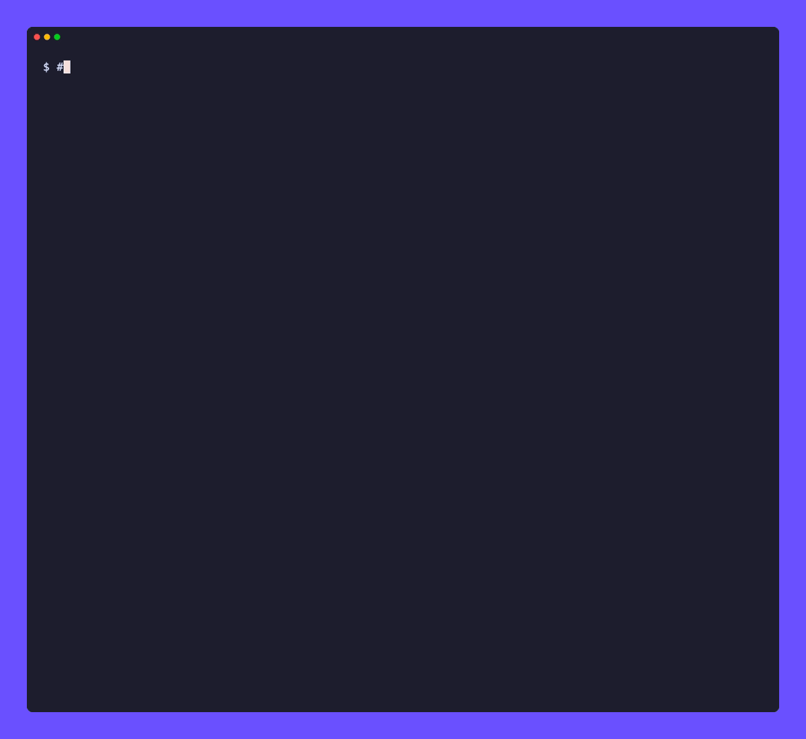
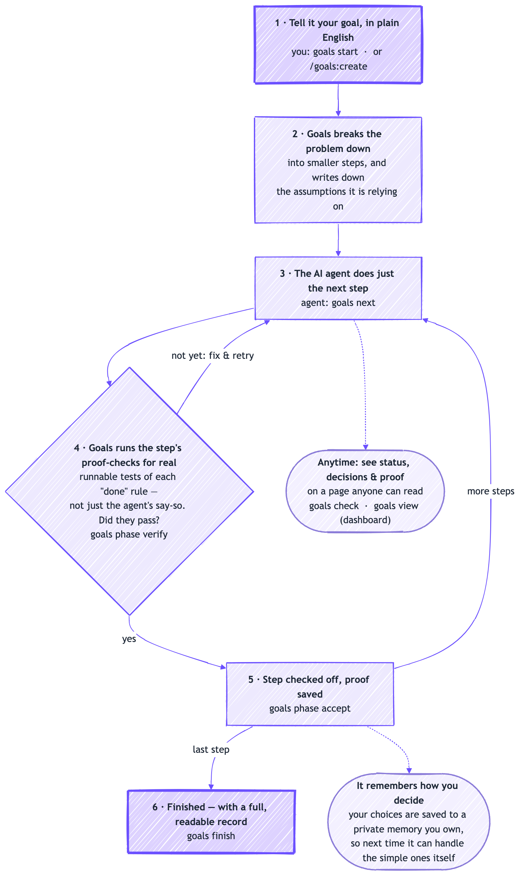
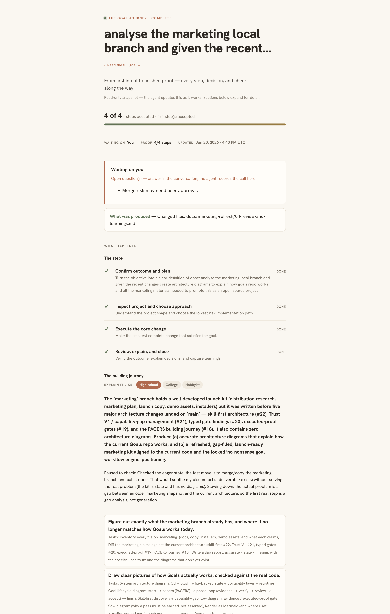

# Goals

**Goals is an open-source plugin for Claude Code and Codex that helps an AI agent
run long enough to actually finish your goal.**

It builds on the native `/goal` loop instead of replacing it: the agent still does
the work, while Goals adds the durable plan, the proof each step ran, the
decisions, and a memory of how you like things done — the things a long run needs
to be something you can trust, check, and pick back up. Everything it does lives
in plain files you own.



**Just say what you want — for example:**

- *"build me a weight-loss tracking app"*
- *"make a web app that resizes and tags my photos"*
- *"add login and payments to my site"*
- *"clean up and document this messy codebase"*

## What Goals does

- **Thinks before it builds.** It breaks your goal into smaller problems, writes
  down the assumptions it's relying on, weighs a few options (including doing
  nothing), and tries to break its own work to catch mistakes — and you can read
  that reasoning in plain English.
- **Proves "done" instead of claiming it.** A step is accepted only after its
  check actually runs and passes. A failed check points to the next fix instead
  of a vague retry.
- **Explains every decision.** "Which database should we use" comes with what it
  picked, whether it's easy to undo, and why it fits your goal.
- **Learns how you decide.** For simple, reversible choices it stops asking and
  decides the way you have before. The risky or hard-to-undo ones still come to you.
- **Stops on your terms.** Set a token budget and a finish condition, so a long
  run can't go forever or quietly run up a bill.
- **Stays yours.** The plan, decisions, proof, and history are plain files you can
  read, edit, and resume in a new session — or hand to a different agent.

## Who it's for

Anyone using AI to get real work done:

- **If you don't code** — you describe the goal and approve decisions in plain English;
  your AI assistant does the heavy lifting, and Goals keeps it on track.
- **If you do code** — a durable, scriptable workflow layer that keeps long AI tasks on
  the rails, with evidence, gates, and a readable audit trail.

## How it works

```
   you say the goal
         │
         ▼
   Goals breaks it into clear steps  ──▶   the AI agent does the next step
         ▲                                             │
         │            you say yes   ◀──── plain decision + proof it works
         └─────────  repeat until done — with a record of everything  ◀─┘
```

Goals runs the **workflow**; your AI assistant (Claude Code, Codex, …) does the **work**.
Goals is the part that keeps it organized, legible, and accountable.

Under the hood it's a small **CLI plus a plugin**, working over **plain files in
your own project** — so the goal, the decisions, and the proof are yours and
survive a `/clear` or a brand-new session. The **assess** step follows PACERS, a
method for [solving problems without rushing](https://medium.com/@shivam.gupta42/how-to-solve-problems-without-rushing-6a329be5e6ae).

Here's the whole loop — each step in plain English, with the command behind it
(click to enlarge):

<p align="center">
  <a href="docs/assets/lifecycle.png"></a>
</p>

And you never lose the thread: a **dashboard anyone can read** shows status,
decisions, and proof at a glance (click to view full size):

<p align="center">
  <a href="docs/assets/dashboard-hero.png"></a>
</p>

<sub>Diagram source: [`docs/assets/lifecycle.mmd`](docs/assets/lifecycle.mmd) — regenerate with `npx -y @mermaid-js/mermaid-cli -i docs/assets/lifecycle.mmd -o docs/assets/lifecycle.png -b white -s 2`.</sub>

See [**docs/architecture.md**](docs/architecture.md) for the full set: system
architecture, the goal lifecycle, skill-first discovery + capability gaps, and the
portability layer that lets a goal survive `/clear`.

## Get started

### Claude Code

Two lines — that's the whole install:

```text
/plugin marketplace add ShivamGupta42/goals
/plugin install goals@goals
```

The first session installs the `goals` CLI for you (macOS/Linux): the plugin
ships its own source and bootstraps it on first run — no separate step. Prefer
the terminal? `goals setup --agent claude` does the same.

### Codex

```bash
goals setup --agent codex
```

Codex picks up Goals' skills from `~/.agents/skills`; run `goals context sync` in a
project to expose the goal in `AGENTS.md`.

### Manual / Windows

Install the CLI directly — one line — then `goals setup --agent both`:

```bash
# macOS / Linux
curl -fsSL https://raw.githubusercontent.com/ShivamGupta42/goals/main/install.sh | sh
```
```powershell
# Windows (PowerShell)
irm https://raw.githubusercontent.com/ShivamGupta42/goals/main/install.ps1 | iex
```

That's it. Now just talk to it in Claude Code:

| You type | What happens |
| --- | --- |
| `/goals:create "build me a weight-loss tracking app"` | Goals turns it into a tracked plan and starts step 1 |
| `/goals:import https://signals.forwardfuture.ai/loop-library/` | Import an external loop/catalog, ask for missing details, and validate it for Claude |
| `/goals:next` | Do the next step; Goals saves the proof and checks it off |
| `/goals:check` | See where things stand and what (if anything) needs *you* |

### Import a loop

Have a loop library, catalog file, or reusable workflow from another project?
Import it directly from Claude Code:

```text
/goals:import https://signals.forwardfuture.ai/loop-library/
```

If the source contains multiple loops or placeholders, Goals asks Claude Code to
ask you the missing questions, then reruns with `--select` and repeated
`--answer KEY=value` flags. It writes the loop design, portable goal files, and
HTML preview into the loop output directory, records source hashes/provenance,
and runs `goals loop check --target-agent claude` before you activate it.

Terminal equivalent:

```bash
goals loop import https://signals.forwardfuture.ai/loop-library/ --out .goals --no-prompt
goals loop check --out .goals --target-agent claude
goals loop activate --out .goals --agent claude
```

See [Importing Loops](docs/LOOP_IMPORT.md) for supported source shapes,
selection, answers, provenance, and validation profiles.

Prefer the terminal? Use `goals start "…"`, then `goals next` and `goals check` — see
[The command set](#the-command-set).

<details><summary>Rather not pipe a script? Install manually</summary>

```bash
# needs uv (https://astral.sh/uv): curl -LsSf https://astral.sh/uv/install.sh | sh
uv tool install git+https://github.com/ShivamGupta42/goals.git
goals setup --agent both
```
</details>

## Why Goals exists

AI agents wander. They skip steps, make quiet decisions, and after a while you've lost
track of what they did. When they *do* turn to you to decide, it's hard — the choice
comes wrapped in jargon you shouldn't have to decode. And once it's built, they often
can't clearly tell you what they made or how.

Goals fixes that. Tell it what you want in plain English. It breaks that into a clear
plan, keeps your AI on track step by step, puts every decision to you in plain words
you can actually answer, and won't say "done" until there's proof. Works whether you
write code or not.

## The command set

Most people only need these:

| Command | What it does |
| --- | --- |
| `goals start "add login and payments to my site"` | Turn a goal into a tracked plan and open a workspace for it |
| `goals next` | Get the next step, ready to hand to your AI |
| `goals check` | Plain-language status: progress, proof, and what needs you |
| `goals view` | Open the dashboard — your goal at a glance, for humans |
| `goals loop import <source>` | Import a loop/catalog from a URL, file, directory, or builder script |
| `goals loop build/check/activate/improve` | Design, validate, start from, and improve the workflow itself |

## It learns how you like goals executed

Goals keeps a tiny, private, **hand-editable** memory of how you like goals run — two
plain-Markdown files under `~/.goals/user/`, yours to read and edit, that never leave
your machine:

- **`observations.md`** — an append-only log of the decisions Goals sees you make as a
  goal runs: *what* you chose and the *context*. It **never invents a "because"**; any
  reason it stores is kept verbatim, and labelled as your own words (`you said:`) only
  when you actually said it.
- **`preferences.md`** — the durable preferences that steer how Goals auto-executes.
  You own this file; Goals only adds to it when you state or confirm a preference, and
  never rewrites your edits.

The split is deliberate: a choice made for one goal is an *observation*, scoped to that
goal — it only becomes a standing preference when **you** confirm it. So Goals gets
better at auto-execution over time without silently turning a one-off into a rule.

Confirmed preferences don't just advise the agent — they **change when Goals asks vs acts**.
Tell it *"ask before anything irreversible"* and it will stop to confirm a decision it would
otherwise have handled silently; tell it *"decide reversible changes yourself"* and it won't
interrupt you for safe ones. A safety floor stays fixed: genuinely risky or irreversible
decisions are always surfaced — a preference can make Goals ask *more*, never less.

At the **end of every goal**, Goals reflects back what it noticed, flags any choice that
has recurred across goals ("promote to a standing preference?"), and shows the
preferences currently in effect.

```bash
goals user digest                 # what Goals noticed this goal + what it'll apply next
goals user record "Keep explanations concise" --area communication
goals user show                   # everything; or just open ~/.goals/user/*.md and edit
```

Full design — the situated-observation model, why no fabricated "because," the
human/agent file split, deliberate tradeoffs, and how an older JSON store is migrated —
is in [**docs/GOAL_EXECUTION_MEMORY.md**](docs/GOAL_EXECUTION_MEMORY.md).

## Keep long runs safe

A long agent loop can run away — retrying a failing step forever, or quietly
burning tokens. Goals ships an **opt-in stop gate** that ends the loop on durable
facts, not a transcript guess. Turn it on with `GOALS_ENFORCE=1`, and it hands
control back to you when either guard trips:

- a phase fails review too many times — `GOALS_MAX_PHASE_ATTEMPTS` (default 3); or
- the session crosses a token budget you set — `GOALS_MAX_TOKENS` (off unless set).

It never traps a finished, paused, or waiting-on-you goal, and fails open if
anything goes wrong (a stuck hook never blocks you). Details:
[docs/subsystems.md](docs/subsystems.md#enforced-stop-gate).

## For developers

Under the hood, Goals is a small CLI + Claude Code / Codex plugin. It keeps goal state,
evidence, decisions, and an append-only history as plain files in your repo, plus a
portable spec any agent can pick up. On `main` it works in an isolated git worktree so
your checkout stays clean. `goals check --json` gives agents a machine-readable view.

Loop imports are intentionally adapter-shaped: a source reader loads URLs/files,
a catalog adapter parses JSON/YAML/HTML fallbacks/builder scripts, and the normalizer
turns one selected loop into Goals' durable `loop-design.json`. Validation profiles
such as `imported-loop`, `browser-ux-loop`, and `benchmark-loop` live in
`registries/profiles.yml` and expand reusable proof requirements during export,
activation, and checking without hiding missing authored stop conditions.

Note: `goals start` runs in a git project (it makes a safe, isolated copy to work in).
Run `goals --help` for the full CLI, portability commands, and the visual loop builder.

## Show you use Goals

Running a project with Goals? Add the badge to your README:

[](https://github.com/ShivamGupta42/goals)

```md
[](https://github.com/ShivamGupta42/goals)
```

## Contributing

Issues and PRs welcome. See [CONTRIBUTING.md](CONTRIBUTING.md) for dev setup, the
checks to run, and the project conventions.

## License

[MIT](LICENSE)
