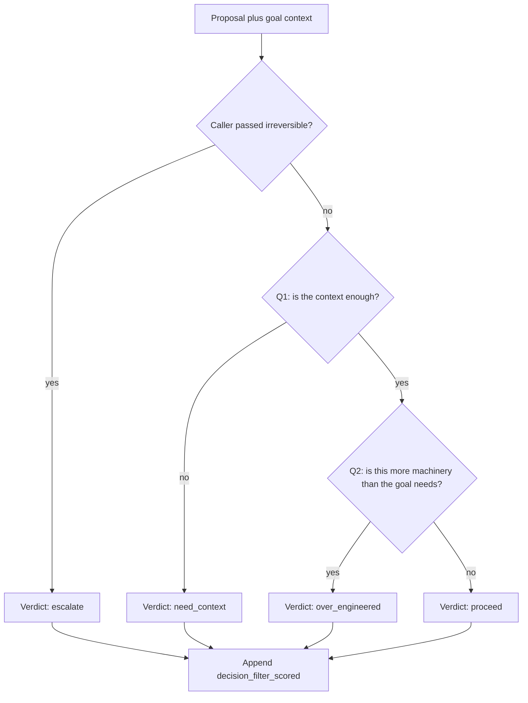

# Decision filter plan

Status: proposed. Nothing in this document is implemented. Command names below
are the intended surface, not commands the CLI has today.

Goals already records what was decided (`JudgementRecord`) and which choices
should interrupt the user (`should_surface_decision`). It does not record what
a model predicted before the user corrected it. That pair is the training row.
A skill file stays the definition of the questions. The filter learns where
this user's boundary sits.

The first slice is the log. Laya is the model that can later be fine-tuned on
those rows. SemIf is an optional frozen baseline: its weights do not update,
so it only changes when the question text or the pasted corrections change.
No model ships in the core install. `pydantic`, `pyyaml`, and `typer` stay the
runtime dependencies.

## What a call does



Q1 and Q2 are separate scores from one shared context. When Q1 is no, Q2 is
stored and does not affect the verdict. A thin proposal is a missing fact.
It is not a request to shrink the change.

Exit code stays 0. `goals decision record` still records. The Stop hook
(`GOALS_ENFORCE`) still means only "the current phase is unfinished."

## Context packet

The model sees a short packet:

- goal objective
- current phase
- known gaps
- the proposal paragraph
- a simpler alternative, only when the caller named one
- the last few corrected rows, as text
- confirmed preference lines, as text

An empty simpler alternative is stored as empty. It does not force
`need_context`. Preference text is context. It is not a training label.
`~/.goals/user/preferences.md` and `observations.md` are not rewritten by a
filter call. Observations still become preferences only when the user confirms
them.

## Verdicts

| Verdict | When |
| --- | --- |
| `escalate` | The caller passed `--irreversible`. The model is not consulted for the verdict. Scores may still be logged. |
| `need_context` | Q1 says the context is not enough. |
| `over_engineered` | Q1 passed and Q2 says the proposal is more machinery than the goal needs. |
| `proceed` | Q1 passed and Q2 says the proposal fits. |
| `uncertain` | An answer key is outside the declared option set, or a score is missing. |
| `unscored` | The model flag is off. The row is still written. |

There is no keyword list for schema, migration, or delete. v1 will not catch
a dangerous change that the caller marked reversible. The skill text, when
this is built, tells the agent to pass `--irreversible` for schema, migration,
and delete. The CLI does not guess.

`should_surface_decision` stays the ask-vs-act rule for `Decision` objects.
It does not see `goals decision record`, which defaults to reversible and
never calls that function. The filter does not pretend that function detects
migrations.

## The log

New event type: `decision_filter_scored`.

Replay keeps the event on the log and does not change goal status. Training
export reads the event log. The projected judgement list does not need a copy
of the score.

Payload:

- goal id, phase id
- the context packet fields above
- Q1 and Q2 option shares
- verdict
- `advisory: true` until a temperature file exists

`caused_by` is not the training link. The store fills an empty `caused_by`
with the previous event, or with the latest `decision_requested`. That link
is noise. A failed phase review is not a label either: a phase can fail
because a check failed.

## The correction

A label is a later user record that names the filter event:

```text
goals decision record "<question>" --choice "<what stood>" --by user --corrects <filter event id>
```

The label is written only when `--by user` and the choice differs from the
filter verdict. An agent record does not label the row. A phase review does
not label the row. The field is `corrects` on the decision event payload, not
`caused_by`.

Those corrected rows are what a later fine-tune consumes. Laya's published
typed-decision jump (about 0.36 to about 0.77) used on the order of 2,000
in-domain decisions. This plan does not fine-tune in the first build. About
30 labeled reversals is the point where a temperature fit can make the
shares honest. A few hundred labeled rows in this question family is the
point where a batch fine-tune is worth running.

## When a verdict may block

Two flags, both off by default:

| Flag | Meaning |
| --- | --- |
| `GOALS_DECISION_MODEL=1` | Run Laya and fill the scores. Still does not block. |
| `GOALS_DECISION_ENFORCE=1` | A verdict may block. |

`GOALS_DECISION_ENFORCE` stays unused until all three are true:

1. A temperature fit exists, built from at least 30 labeled reversals.
2. A held-out set beats a keyword baseline.
3. The flag is set on purpose.

Until then every model verdict is advisory, including `proceed`.

## Tests for the first build

- Q1 no stays `need_context` when Q2's overbuilt share is 0.99.
- `--irreversible` is `escalate`, and a model proceed share does not change that verdict.
- An empty simpler alternative plus a concrete proposal is not forced to `need_context`.
- `--corrects` on a user record with a different choice sets the label. An agent record does not. A failed phase review does not.
- With both flags unset, the test suite downloads nothing, and the core install imports with no `laya` and no torch.
- A filter call leaves the preference files byte-identical.
- Answer keys outside the declared set become `uncertain`, and the returned text is not executed.

## Out of scope for the first build

- Fine-tuning, and the temperature-fit command.
- Wiring the filter into the Stop hook.
- A SemIf adapter.
- Promoting observations into preferences.
- Detecting schema or migration from the proposal text.
