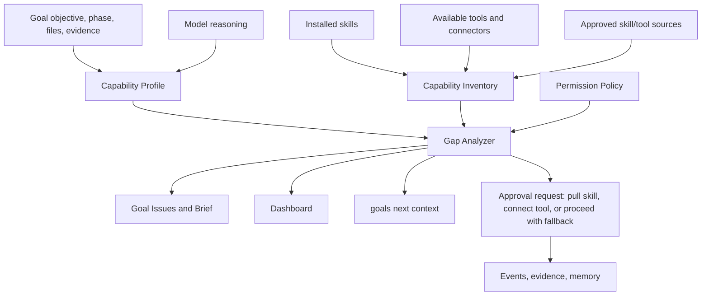

# Trust V1 Long-Term Improvement Plan

This plan turns the Trust V1 dogfood findings, review-loop findings, and two
real-world goal simulations into one long-term architecture. The north star is
simple: Goals should stay the durable evidence and coordination layer while
native agents, installed skills, plugins, browser tools, and the model do the
specialized work.

Goals should not become a giant framework that reimplements every skill, browser
driver, financial tool, document parser, or research workflow. It should help the
model notice what capability is missing, ask the user for the right external
source or connector, run what is locally safe, and record proof.

## Implemented Slice

Status: partial vertical slice implemented on 2026-06-20.

What now exists:

- Compatibility hardening: replay drops unknown fields inside event records,
  evidence, verification artifacts, checkpoints, decisions, assumptions,
  breakdowns, architecture maps, and source records before validating strict
  models.
- Capability models: `CapabilityNeed`, `CapabilityMatch`, `CapabilityGap`, and
  `CapabilityCheckReport`.
- Read-only analyzer: `goals capability check [--json] [--strict] [--agent
  auto|claude|codex] [--need ...]`.
- Live skill inventory matching, including installed skills, bundled-but-not-
  installed skills, and per-agent availability.
- Codex skill discovery now uses `~/.agents/skills` as the primary native root
  and keeps legacy `~/.codex/skills` as a fallback.
- Missing capability gaps surface in `goals issues`, `goals brief`, `goals
  check`, the dashboard, and full `goals next --full` handoffs.
- Tests cover missing browser capability, Claude-only skill while checking
  Codex, bundled skill install hints, dashboard visibility, CLI JSON, and future
  evidence/artifact field replay.

What remains future work:

- Durable capability profile/source events.
- External skill-source governance and install flows.
- Browser/tool preflight adapters beyond skill availability checks.
- Artifact classes and repair plans.
- Repeated capability-gap memory promotion.

## Design Principles

1. **Ledger, not monolith.** Goals owns durable state, phase acceptance, lineage,
   artifact identity, source freshness, and user-visible decisions.
2. **Model intelligence first.** The model proposes the capabilities a phase
   needs and explains why. Deterministic Goals code checks local inventory,
   permissions, and evidence.
3. **Adapters over rewrites.** Claude, Codex, browser automation, Drive, GitHub,
   and future tools are thin adapters. The CLI remains the stable engine.
4. **Skills are acquired, not bundled endlessly.** Goals ships a small set of
   generic skills and points the user to approved external skill sources when a
   task needs more.
5. **Capability gaps are first-class issues.** Missing skills, missing tools,
   stale sources, unavailable browser access, and weak verification appear in
   `goals issues`, `goals brief`, `goals check`, and the dashboard.
6. **Proof must be reproducible.** Artifact hashing should reward deterministic
   outputs and explain exactly how to repair stale or self-mutating proof.
7. **Ask only for real user choices.** Pulling third-party skills, connecting a
   browser, using account data, or enabling paid/external services needs user
   approval. Routine local checks stay with the agent.

## The 48-Issue Improvement Inventory

The table below is intentionally broad. Some items are bugs, some are product
friction, and some are architectural gaps. The plan treats them as one backlog
because they share the same root problem: Goals needs a capability-aware layer
between "the model can probably figure it out" and "the repo shipped a bespoke
implementation."

| ID | Area | Issue | Long-term resolution |
|---|---|---|---|
| I-01 | Evidence | Generated reports with wall-clock timestamps break artifact hashes. | Add artifact stability guidance and support deterministic run parameters in evidence templates. |
| I-02 | Evidence | Final `.goals` exports and dashboards mutate when final events are appended. | Classify live goal exports as finalize-after-accept artifacts, not self-hashed phase proof. |
| I-03 | Evidence | Architecture maps evolve later, making earlier phase hashes stale. | Add explicit re-proof guidance and stale-artifact repair actions when a shared artifact changes. |
| I-04 | Evidence | `changed_files` treats source, generated, transient, and live state the same. | Add artifact classes: source, generated-stable, generated-live, external, ephemeral. |
| I-05 | Evidence | Verification commands can both mutate and validate artifacts in one step. | Split prepare, verify, and finalize commands in the evidence model and handoff guidance. |
| I-06 | Evidence | Artifact mismatch repair is manual and easy to misunderstand. | Add `goals validate --repair-plan` that prints the exact phase and safe re-proof path. |
| I-07 | Evidence | Output hashes exist but are not visible enough to users. | Show verification exit code and output hash in dashboard evidence and lineage views. |
| I-08 | Evidence | Failed inline JSON/shell evidence is common. | Prefer evidence files, generate templates, and lint evidence JSON before phase recording. |
| I-09 | Skills | Goals does not infer what skills a task probably needs. | Partially implemented with read-only inferred/explicit capability needs; durable model-authored profiles remain future work. |
| I-10 | Skills | Missing skills are surfaced mostly in loop designs, not normal goals. | Implemented vertical slice: capability gaps appear in `goals issues`, `goals brief`, `goals check`, and dashboard. |
| I-11 | Skills | Skill discovery lists installed skills but does not recommend likely ones. | Add semantic skill matching against objective, phase, files, and acceptance criteria. |
| I-12 | Skills | Goals has no safe path to ask for external skill packs. | Add approved skill-source descriptors and user approval prompts before pulling repos. |
| I-13 | Skills | A skill may exist for Claude but not Codex, or vice versa. | Partially implemented in `goals capability check --agent ...`; loop HTML remains future work. |
| I-14 | Skills | Skill quality is unknown. | Track skill provenance, last use, success/failure memory, and optional trust level. |
| I-15 | Skills | Phase prompts do not explicitly say "you lack a capability." | Include capability gaps in `goals next` and native context blocks. |
| I-16 | Skills | Repeated skill friction is not automatically promoted into product work. | Feed capability-gap events into self-evolution memory and `goals loop improve`. |
| I-17 | Browser/tools | Browser tooling issues are discovered late, often during visual/dashboard checks. | Add browser/tool preflight checks before phases that need browsing, screenshots, or UI inspection. |
| I-18 | Browser/tools | Tool permissions are too coarse for browser, connectors, paid APIs, and account data. | Extend permission policy subjects to concrete capabilities and side effects. |
| I-19 | Browser/tools | No standard fallback exists when browser automation is unavailable. | Add fallback plans: static HTML render, Playwright if installed, manual browser approval, or skip with recorded gap. |
| I-20 | Browser/tools | Dashboard/browser visual checks are not consistently verified. | Add optional browser adapter checks for dashboard open, screenshot, and content assertions. |
| I-21 | Browser/tools | Tool run outputs are not normalized across CLI, browser, plugins, and connectors. | Record tool-run evidence through a common run-capture envelope. |
| I-22 | Browser/tools | External connectors are not represented as capability inventory. | Add connector/tool inventory discovery alongside skills. |
| I-23 | Browser/tools | Goals cannot tell whether a tool source is trusted. | Add user-approved capability source records with provenance and scope. |
| I-24 | Browser/tools | Users are not given a clear "please connect/pull this capability" prompt. | Add one-question capability approvals with concrete install/connect commands. |
| I-25 | UX | `goals next` can become a wall of text. | Default to a short handoff and keep exhaustive instructions behind `--full`. |
| I-26 | UX | Worktree vs in-place behavior is still surprising. | Keep base branches protected, but make the active worktree path and rationale obvious. |
| I-27 | UX | Worktree names can still be hard to scan in complex goals. | Keep short slugs plus ids and expose a friendly display name. |
| I-28 | UX | `assess breakdown` still has JSON friction for users and agents. | Add flag and guided forms, plus model-generated breakdown templates. |
| I-29 | UX | Audience-level wording is uneven across assumptions, breakdowns, and issues. | Apply audience notes consistently to breakdowns, issue summaries, and dashboard text. |
| I-30 | UX | `--help` exposes too many building blocks at first contact. | Add a "new here" path and demote advanced commands visually. |
| I-31 | UX | `start` and `create` remain conceptually close. | Clarify `start` as normal entrypoint and `create` as advanced/worktree primitive. |
| I-32 | UX | Absolute path repetition overwhelms non-technical users. | Prefer relative paths in handoffs, with absolute paths only in machine-readable JSON. |
| I-33 | Architecture | Architecture maps are manually maintained and can drift. | Keep maps human/model-authored but add stronger code-surface and artifact drift checks. |
| I-34 | Architecture | Code-derived architecture checks are shallow. | Use model-assisted map suggestions, then deterministic checks for file coverage. |
| I-35 | Architecture | Generated/transient files pollute architecture coverage. | Let maps and evidence mark files as ignored, generated-stable, or generated-live. |
| I-36 | Architecture | Capability, artifact, and phase concepts are mixed across modules. | Implemented vertical slice: `src/goals/capabilities.py` feeds issues, brief, dashboard, check, and mode prompts. |
| I-37 | Architecture | Parallel worktree architecture maps can conflict at merge time. | Add merge-readiness checks for architecture map overlap and stale node evidence. |
| I-38 | Architecture | Re-accepting earlier phases after shared artifacts change is awkward. | Add a re-proof workflow that keeps the causal chain clear. |
| I-39 | Dashboard | Dashboard is readable but not enough of a diagnostic cockpit. | Add capability, lineage, artifact stability, and repair-plan sections while staying read-only. |
| I-40 | Portability | Portable spec v1 is export-only. | Plan portable spec v2 import/round-trip with capability gaps and artifact classes. |
| I-41 | Gates | Strict validation is separate from phase review unless agents remember it. | Make strict validation a recommended or configurable closing gate. |
| I-42 | Gates | P2s can accumulate without product-level prioritization. | Group P2s by repeated memory/capability area and turn them into improvement proposals. |
| I-43 | Gates | Review/fix loops are instructions, not reusable goal patterns. | Add loop templates for review-and-fix, dogfood, migration, browser QA, and release readiness. |
| I-44 | Gates | Validation failures can name symptoms but not the repair workflow. | Attach repair hints to dangling causes, artifact mismatches, stale maps, and missing skills. |
| I-45 | Gates | Known gaps are not always tied to future capabilities. | Let known gaps reference missing capabilities, sources, or skill requests. |
| I-46 | Gates | The model is not asked to diagnose why a gate failed. | Add model-authored diagnostic notes that sit beside deterministic findings. |
| I-47 | Memory | Local self-evolution memory is not visible enough in planning. | Surface repeated memory suggestions in goal start, next, issues, and dashboard. |
| I-48 | Ecosystem | There is no governance model for external skill/tool sources. | Add capability-source records, trust levels, user approval, and sync/import commands. |

## Long-Term Architecture

The architecture should add one deep module rather than many bespoke features:
**Capability Gap Management**.

### 1. Capability Profile

A profile is a small structured object created per goal and refreshed per phase.
The model proposes it; Goals validates only its shape.

Example fields:

- `needs`: browser, web research, UI screenshot, spreadsheet parsing, finance
  analysis, code review, security scan, data visualization, docs writing.
- `why`: plain reason this capability matters for the phase.
- `required_for_acceptance`: true or false.
- `risk`: low, medium, high.
- `fallback`: what the agent can do if the capability is missing.
- `suggested_skill_queries`: semantic phrases for matching installed skills.
- `suggested_tool_kinds`: browser, connector, plugin, CLI, local package.

This should not be a giant hard-coded taxonomy. Start with a small set of common
kinds and let the model use free-text tags. Deterministic code only needs to
know whether each need is satisfied, missing, risky, or approved.

### 2. Capability Inventory

Inventory should merge several live sources:

- Skills from `~/.claude/skills`, `~/.agents/skills`, legacy
  `~/.codex/skills`, and Goals bundled skills.
- Plugin or connector metadata exposed to the current agent environment.
- CLI tools detected locally, for example browser drivers or test runners.
- Registries owned by the project, for example permission policies.
- User-approved external skill repositories.

This builds on `src/goals/skill_discovery.py` instead of replacing it. The
current `DiscoveredSkill` model becomes one inventory adapter. Tool and connector
inventory can be added beside it.

### 3. Gap Analyzer

The analyzer compares profile to inventory and emits deterministic findings:

- satisfied by installed skill or tool;
- partially satisfied by a skill installed for only one agent;
- missing but can be installed from a bundled skill;
- missing and requires user-approved external source;
- available but requires permission because it uses browser/account/network;
- unavailable, so use fallback and record a known gap.

These findings should flow into:

- `goals issues`;
- `goals brief`;
- `goals next`;
- dashboard;
- memory suggestions;
- optional checkpoints.

### 4. Skill Source Acquisition

Goals should ask for skills, not silently pull them. The prompt should be short
and concrete:

> This phase needs browser/UI inspection. I found no installed browser-testing
> skill for Codex. Approve pulling a skill pack from a repository you trust, or
> give me a repo URL to inspect first?

Implementation shape:

- `registries/capability_sources.yml` stores descriptors, not vendored code.
- Each descriptor includes name, URL, supported agents, capabilities,
  install target, trust level, and whether review is required.
- `goals capability sources list` shows configured sources.
- `goals capability sources add <url>` records a user-approved source.
- `goals capability install --source <id> --skill <name> --target codex` copies
  only after showing the file diff or source summary.
- External installs become events with provenance.

Goals can ship a few generic descriptors, but the user should approve actual
pulls. This keeps the repo small and avoids pretending we can maintain every
Claude/Codex/community skill locally.

### 5. Browser And Tooling Support

Browser support should be modeled as a capability, not as a bespoke dashboard
feature. A browser/UI phase might require:

- open local dashboard;
- inspect DOM text;
- capture screenshot;
- run Playwright if available;
- verify no blank canvas or missing assets;
- fall back to static HTML checks when browser access is unavailable.

Commands:

- `goals capability check browser`
- `goals tool preflight --kind browser`
- `goals dashboard --verify` as a thin wrapper over the browser capability
- `goals phase evidence ...` templates that include browser checks only when
  the capability is present or approved

The model should decide when browser verification is relevant. Goals should
decide whether the tool exists, whether permission is required, and whether the
result was recorded as evidence.

### 6. Artifact Lifecycle

Trust V1 should grow from "hash changed files" to "understand artifact roles."

Artifact classes:

- `source`: hand-authored files that should remain stable after proof.
- `generated-stable`: generated outputs that are deterministic when given fixed
  inputs, such as reports with `--as-of`.
- `generated-live`: outputs intentionally updated by later goal events, such as
  `.goals/goal-state.json` and dashboard HTML.
- `external`: links, URLs, datasets, or screenshots whose content may need a
  source freshness policy.
- `ephemeral`: logs, caches, bytecode, temp files, or local state that should not
  be evidence.

Flow:

1. Prepare artifacts.
2. Verify without mutating already-hashed proof.
3. Record artifact hashes.
4. Accept phase.
5. Finalize live generated outputs after accept.

When a shared artifact changes later, strict validation should say:

- which earlier phase is stale;
- why it is stale;
- whether re-proof is safe;
- the command to re-record evidence;
- whether the artifact should be reclassified.

### 7. Dashboard And Briefing

The dashboard should stay read-only, but it should become a better diagnostic
surface:

- current phase and next safe step;
- capability gaps and installed/available skills;
- browser/tool preflight status;
- strict validation summary;
- artifact stability classes and mismatches;
- lineage chains for proof, review, and acceptance;
- memory suggestions that are repeated enough to matter;
- user questions separated from agent repair actions.

`goals brief` should be the same information in plain language, suitable for one
user-facing question.

## Implementation Roadmap

### Phase A: Plan And Schemas

Status: partially implemented for read-only capability reports; durable events
and artifact classes remain future work.

Deliverables:

- Add `CapabilityNeed`, `CapabilityInventoryItem`, `CapabilityGap`, and
  `CapabilitySource` models.
- Add events: `capability_profile_recorded`, `capability_gap_recorded`,
  `capability_source_recorded`, `capability_resolved`.
- Add artifact class fields to evidence artifacts in a backward-compatible way.
- Document the artifact lifecycle and capability-gap philosophy.

Verification:

- Legacy events and evidence still load.
- Portable exports ignore unknown future capability fields safely.

### Phase B: Read-Only Capability Checks

Status: partially implemented.

Deliverables:

- `goals capability profile --file ...`
- `goals capability check [--json]`
- Skill matching over installed skills using name, description, source, and
  agent availability.
- Tool preflight for browser, local CLI tools, and connector presence where the
  environment exposes metadata.

Verification:

- Missing skill produces a P1 issue when required for acceptance.
- Optional missing skill produces a P2 issue and fallback guidance.
- Claude-only skill produces a Codex install hint.

### Phase C: User Approval And Skill Sources

Deliverables:

- `registries/capability_sources.yml`
- `goals capability sources list|add|inspect`
- `goals capability install` with dry-run default for external sources.
- Permission-policy integration for remote pulls and connector use.
- Plain approval prompt generation for `goals brief`.

Verification:

- External repo pull requires user approval.
- Bundled skill install remains local and reversible.
- Source provenance is recorded and shown in lineage.

### Phase D: Browser/Tool Adapter Layer

Deliverables:

- Tool inventory adapter interface.
- Browser preflight adapter.
- Dashboard verification wrapper.
- Evidence template snippets for browser checks.
- Fallback guidance when no browser tool exists.

Verification:

- In an environment with no browser tool, Goals records a capability gap and
  suggests fallback.
- In an environment with browser tooling, Goals records a passing preflight and
  can verify dashboard text.

### Phase E: Artifact Lifecycle And Repair Plans

Deliverables:

- Artifact classes in evidence.
- `goals validate --repair-plan`.
- `goals phase reproof <phase_id>` helper that creates a new evidence template
  from the latest mismatches.
- Guidance that generated-live files are finalized after acceptance.

Verification:

- Timestamped report mismatch suggests deterministic parameterization.
- `.goals/goal-state.json` self-hash mismatch suggests generated-live
  reclassification.
- Stale architecture map hash suggests re-proof of the map phase.

### Phase F: Dashboard, Brief, And Memory Integration

Status: partially implemented for dashboard, issues, brief, check, and full
next handoffs. Memory integration remains future work.

Deliverables:

- Capability section in dashboard.
- Capability gaps in `goals issues`, `goals brief`, `goals check`, and
  `goals next`.
- Repeated gaps absorbed into self-evolution memory.
- Loop improvement suggestions generated from repeated missing skills/tools.

Verification:

- Two repeated missing-browser observations produce a user-visible memory
  suggestion.
- Dashboard shows no capability section when no gaps exist.

### Phase G: Dogfood With Complex Goals

Run at least five end-to-end goals:

1. Finance/reporting task with deterministic generated artifacts.
2. Incident/SLA triage with architecture evolution.
3. Browser/dashboard QA task with and without browser tooling available.
4. Research task requiring fresh sources and external browsing.
5. Document/spreadsheet task requiring an external connector or local fallback.

Exit criteria:

- All goals complete with `goals validate --strict`.
- Every missing skill/tool is surfaced before it blocks acceptance.
- User approvals are limited to external sources, account data, paid tools, or
  irreversible side effects.
- No large third-party skill repository is vendored into Goals.

## What Not To Build In This Repo

Do not build:

- a full browser automation framework;
- a finance analysis framework;
- a document/spreadsheet engine;
- a package manager for every Claude/Codex community skill;
- a second agent runtime;
- a proprietary tool registry that must be constantly updated.

Build instead:

- small capability schemas;
- live inventory adapters;
- permission-aware user prompts;
- provenance events;
- deterministic evidence capture;
- repair plans;
- dashboard/brief surfaces that help the model and user choose the right next
  action.

## First Concrete Slice

Implemented:

1. Add capability need, match, gap, and report models; durable capability
   profiles remain future work.
2. Add `goals capability check --json`.
3. Compare model-authored skill needs against installed skills.
4. Surface missing required skills as `goals issues` findings.
5. Add dashboard and `goals brief` rendering for those gaps.
6. Add tests for a missing browser skill, a Claude-only skill while running
   Codex, and a bundled skill that can be installed locally.

This solves the biggest strategic gap without turning Goals into a giant tool
bundle.
