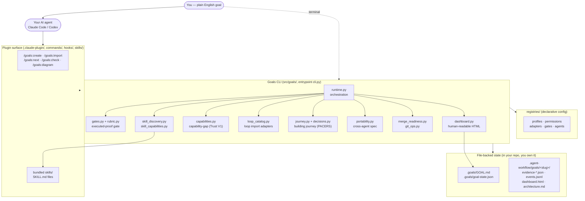
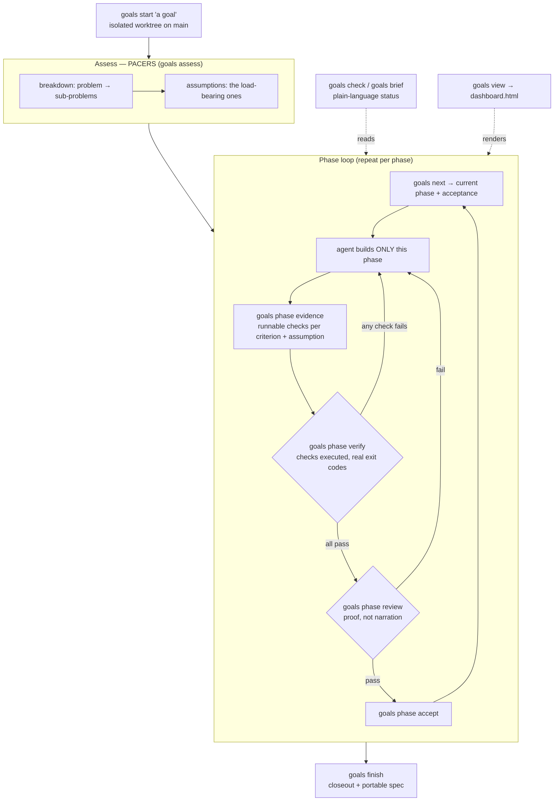
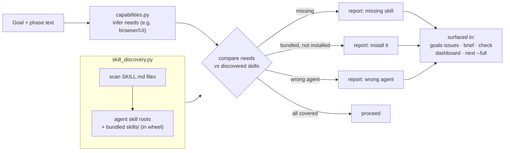
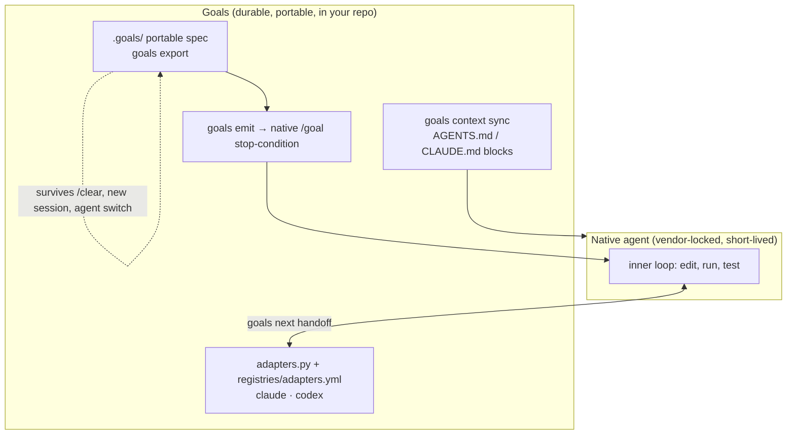

# How Goals works — architecture diagrams

**Phase P3 deliverable (part 1).** Four diagrams that explain the repo to a
newcomer. Every node maps to a real module in `src/goals/`, a real `goals`
command, or a real file in `registries/` / `.claude-plugin/`. GitHub renders
Mermaid natively, so these display inline in the README and on the repo page.

> Honest line: **Goals runs the workflow; your AI does the work.** The agent
> executes each step; Goals keeps the plan, the decisions, and the proof.

---

## 1. System architecture (what's in the box)

A small Python CLI + a Claude Code / Codex plugin, sitting over plain files you
own. No server, no database.



**Why it's shaped this way:** state lives in *your* repo as plain files, so a goal
survives `/clear`, a new session, or even a different agent. The registries make
behaviour declarative; the plugin is just a thin command surface over the CLI.

---

## 2. The goal lifecycle (start → done)

The loop every goal runs through. PACERS (Pause, Assess, Choose, Execute, Review,
Systemize) is recorded as a readable *building journey*; a phase is accepted only
after its checks **actually run**.



**The differentiator:** between `verify` and `accept`, the engine *runs* your
checks and records real exit codes (`gates.py`). A passing result can't be
asserted by the agent — it has to be earned.

---

## 3. Skill-first discovery + capability-gap (Trust V1)

Before working, Goals checks it actually *has* the skills/tools a goal needs.



**Why it matters:** an agent that starts a UI task with no browser skill wastes a
session. Goals catches the gap up front and tells you, in plain language, what's
missing (`goals capability check`).

---

## 4. The portability layer (why a goal outlives one session)

Native agents own the fast inner loop but their goal/task primitives are
vendor-locked and short-lived. Goals owns the durable, portable state.



**The wedge in one sentence:** your agent forgets the plan on `/clear`; Goals
keeps the goal, the decisions, and the evidence in files you own — and any agent
can pick the goal back up.

---

## Validation

Every component above is checked against the codebase in the P3 evidence
(`evidence-p3.json`): each named module exists in `src/goals/`, each `goals`
command exists in `goals --help`, and each registry file exists in `registries/`.

## Rendering to static images (for social preview / hero)

GitHub renders these Mermaid blocks inline. For a static hero/social-preview image:

```bash
npx -y @mermaid-js/mermaid-cli -i docs/marketing-refresh/02-architecture-diagrams.md \
  -o docs/marketing-refresh/assets/architecture.svg
```

If the render tool or network is unavailable in CI, this is the same
screen-capture follow-up bucket as the demo GIF (see `03-launch-kit.md`).
